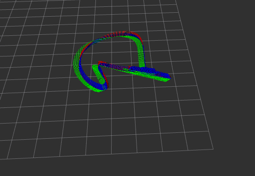
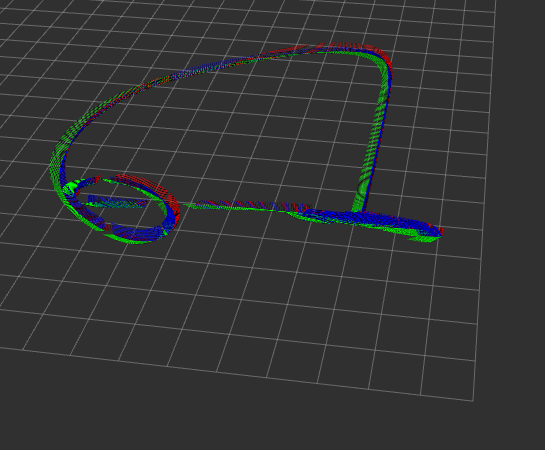
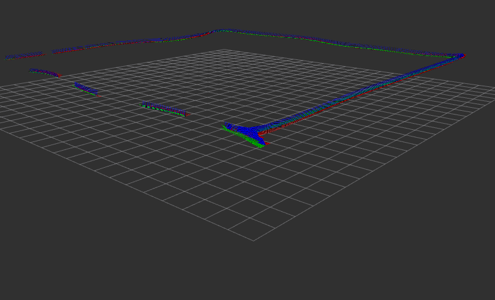
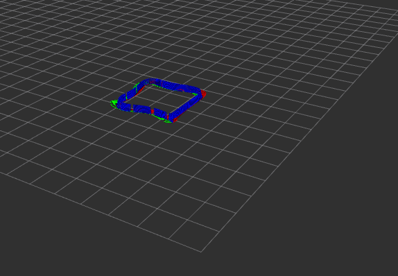
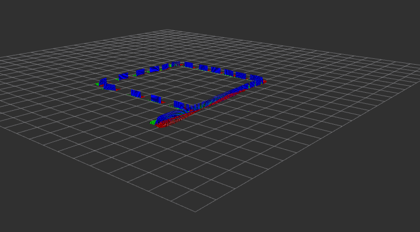
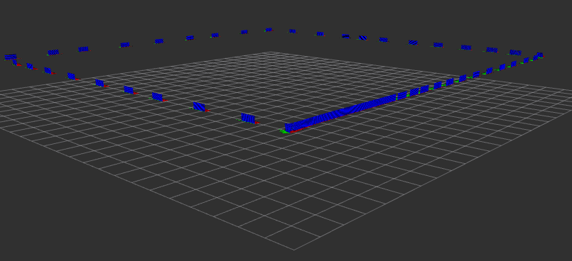

# Laboratory 2
Before starting **important**:
```bash
source devel/setup.bash
```
It is good practice to run at startup even if it is not used directly:
```bash
roscore
```

## Start
Check that everything is working
```bash
catkin_make
roslaunch hector_quadrotor_gazebo quadrotor_empty_world.launch
```
This command opens gazebo11 where you can view the drone.

## Exercise 1

**Identify the mass of the quadrotor, where the sonar sensor is described and the topic where ros publishes the measurements of this sensor. Indicate also the type of data published by this topic and the values published by the sonar sensor when the quadrotor is standing on the ground. In order to see the measurement, it will be necessary to display the content of the topic by executing the command "rostopic echo".**

* Mass Sonar quadrotor : `0.001`
* Sonar sensor : `hector_quadrotor_description/urdf/quadrotor.gazebo.xacro`
* Topic: `sonar height`
`hector_quadrotor_noetic/hector_models/hector_sensors_description/urdf/sonar_sensor.urdf.xacro`

```bash
$ rostopic echo sonar_height
```
```
header: 
  seq: 9820
  stamp: 
    secs: 982
    nsecs: 300000000
  frame_id: "sonar_link"
radiation_type: 0
field_of_view: 0.6981319785118103
min_range: 0.029999999329447746
max_range: 3.0
range: 0.16743995249271393

```

## Exercise 2

**Another way to publish the speed is by using the "rostopic pub" command. Write the command that publishes a linear velocity at z of 0.15 in the "cmd_vel" topic. Check it out visually on the simulator**
```bash
$ rostopic pub -r 100 /cmd_vel geometry_msgs/Twist '[0, 0, 0.15]' '[0, 0, 0]'
```

## Exercise 3

**Write the default values of the following PID controllers: “twist controller linear.x”, “twist controller angular.z” and “pose controller yaw”.**

It appears in the file: `hector_quadrotor_noetic/hector_quadrotor/hector_quadrotor_controller/params/controller.yaml`

```
controller:
  pose:
	…
    yaw:
      k_p: 2.0
      k_i: 0.0
      k_d: 0.0
      limit_output: 1.0

  …
    linear/xy:
      k_p: 5.0
      k_i: 1.0
      k_d: 0.0
      limit_output: 10.0
      time_constant: 0.05

  …
    angular/z:
      k_p: 5.0
      k_i: 2.5
      k_d: 0.0
      limit_output: 3.0
      time_constant: 0.1

```

## Exercise 4

**In the twist_controller.cpp file, what is the name of the variable that stores the desired and current linear.y velocities?. Copy the lines of code that implement the linear.z controller.**

`struct hector_quadrotor_controller::TwistController::<unnamed>`
`hector_quadrotor_controller::TwistController::pid_`
`pid_.linear.y.init(ros::NodeHandle(controller_nh, "linear/xy"));`
```c++
// Auto engage/shutdown
   if (auto_engage_) {
     if (!motors_running_ && command.linear.z > 0.1 && load_factor > 0.0) {
       motors_running_ = true;
       ROS_INFO_NAMED("twist_controller", "Engaging motors!");
     } else if (motors_running_ && command.linear.z < -0.1 /* && (twist.linear.z > -0.1 && twist.linear.z < 0.1) */) {
       double shutdown_limit = 0.25 * std::min(command.linear.z, -0.5);
       if (linear_z_control_error_ > 0.0) linear_z_control_error_ = 0.0; // positive control errors should not affect shutdown
       if (pid_.linear.z.getFilteredControlError(linear_z_control_error_, 5.0, period) < shutdown_limit) {
         motors_running_ = false;
         ROS_INFO_NAMED("twist_controller", "Shutting down motors!");
       } else {
         ROS_DEBUG_STREAM_NAMED("twist_controller", "z control error = " << linear_z_control_error_ << " >= " << shutdown_limit);
       }
     } else {
       linear_z_control_error_ = 0.0;
     }

```

## Exercise 5

**In the motor_controller.cpp file, copy the lines of code which rotate the quadrotor in z**

```c++
// Update output
   if (wrench_.wrench.force.z > 0.0) {


     double nominal_thrust_per_motor = wrench_.wrench.force.z / 4.0;
     motor_.force[0] =  nominal_thrust_per_motor - wrench_.wrench.torque.y / 2.0 / parameters_.lever;
     motor_.force[1] =  nominal_thrust_per_motor - wrench_.wrench.torque.x / 2.0 / parameters_.lever;
     motor_.force[2] =  nominal_thrust_per_motor + wrench_.wrench.torque.y / 2.0 / parameters_.lever;
     motor_.force[3] =  nominal_thrust_per_motor + wrench_.wrench.torque.x / 2.0 / parameters_.lever;


     double nominal_torque_per_motor = wrench_.wrench.torque.z / 4.0;
     motor_.voltage[0] = motor_.force[0] / parameters_.force_per_voltage + nominal_torque_per_motor / parameters_.torque_per_voltage;
     motor_.voltage[1] = motor_.force[1] / parameters_.force_per_voltage - nominal_torque_per_motor / parameters_.torque_per_voltage;
     motor_.voltage[2] = motor_.force[2] / parameters_.force_per_voltage + nominal_torque_per_motor / parameters_.torque_per_voltage;
     motor_.voltage[3] = motor_.force[3] / parameters_.force_per_voltage - nominal_torque_per_motor / parameters_.torque_per_voltage;


     motor_.torque[0] = motor_.voltage[0] * parameters_.torque_per_voltage;
     motor_.torque[1] = motor_.voltage[1] * parameters_.torque_per_voltage;
     motor_.torque[2] = motor_.voltage[2] * parameters_.torque_per_voltage;
     motor_.torque[3] = motor_.voltage[3] * parameters_.torque_per_voltage;


     if (motor_.voltage[0] < 0.0) motor_.voltage[0] = 0.0;
     if (motor_.voltage[1] < 0.0) motor_.voltage[1] = 0.0;
     if (motor_.voltage[2] < 0.0) motor_.voltage[2] = 0.0;
     if (motor_.voltage[3] < 0.0) motor_.voltage[3] = 0.0;


   } else {
     reset();
   }

```

## Exercise 6

**Modify the controller.launch in order to perform a pose controller. Use "rostopic pub" on the “command/pose” topic to make the quadrotor go up 2 meters.**

NOTE: making changes in a file that is not “ours” is not a good practice. Ideally, we would replicate a launch file in a new package to modify the controller there. Since we would have to replicate the launch files structure, we do this for the sake of simplicity.**

Modificar el fichero `~/catkin_ws/src/hector_quadrotor_noetic/hector_quadrotor/hector_quadrotor_controller/launch/controller.launch`

```xml
<launch>
  <rosparam file="$(find hector_quadrotor_controller)/params/controller.yaml" />

  <node name="controller_spawner" pkg="controller_manager" type="spawner" respawn="false" output="screen" args="
    controller/twist controller/pose
     --shutdown-timeout 3"/>
</launch>
```

```bash
rostopic pub /command/pose geometry_msgs/PoseStamped '{ header: {stamp: now, frame_id: "world"}, pose: { position: { x: 0.0, y: 0.0, z: 2.0 }, orientation: { x: 0.0, y: 0.0, z: 0.0, w: 1.0 }}}'
```
## Exercise 7

**Complete the package, pXX_arob_lab2_drones (where pXX corresponds to the assigned pair number for this course (e.g., p00, p01 ...)), with a node called followTargets3D that reads from a text file the list of 3D targets (X,Y,Z) and publish them one by one to the topic /command/pose. The new goal is published when the robot is “sufficiently close” to the previous target. We provide a preliminary structure of the package. Your tasks are to complete the package information in the “CMakeLists.txt” and “package.xml” with the dependencies and executables, and implement the missing parts of the code in “follow_targets_3d.hpp” and “follow_targets_3d.cpp”.**

Complete the `src/p14_arob_lab2_drones/CMakeLists.txt` file by adding the correct dependencies.
```cmake
add_library(${PROJECT_NAME}_lib src/follow_targets_3d.cpp)
add_executable(followTargets3DNode src/follow_targets_3d_node.cpp)


target_link_libraries(followTargets3DNode
 ${catkin_LIBRARIES}
 ${PROJECT_NAME}_lib  # Enlaza con la librería
)
```

Update `src/second_package/package.xml` with the necessary dependencies.
```xml
<build_depend>roscpp</build_depend>
 <build_depend>rospy</build_depend>
 <build_depend>std_msgs</build_depend>
 <build_export_depend>roscpp</build_export_depend>
 <build_export_depend>rospy</build_export_depend>
 <build_export_depend>std_msgs</build_export_depend>
 <exec_depend>roscpp</exec_depend>
 <exec_depend>rospy</exec_depend>
 <exec_depend>std_msgs</exec_depend>
```
`Bash`
```bash
rosrun lab2_drones followTargets3DNode _targets_file_path:=/home/arob/catkin_ws/src/p14_arob_lab2_drones/data/targets.txt
```

## Exercise 8
**Use the configuration cfg/arob_lab2.rviz to visualize the trajectory followed by the quadrotor for the different lists of targets provided in the lab. Include a screenshot of each one of them. Explain what is the cause for the different behaviors.**

To execute this program do the following:
```bash
catkin_make
roslaunch hector_quadrotor_gazebo quadrotor_empty_world.launch
rosrun rviz rviz OPTIONAL:-d /src/p14_arob_lab2_drones/cfg/rviz.cfg #Launch rviz
```
If not loaded the preconfig cfg well, do it manually in `File->Open Config`:

`catkin_ws/src/p14_arob_lab2_drones/cfg/arob_lab2.rviz`

Next run the node of the follow targets:
```bash
rosrun lab2_drones followTargets3DNode _targets_file_path:=/home/arob/catkin_ws/src/p14_arob_lab2_drones/data/targets.txt
```

**Enjoy the views in Gazebo**

**Target 1**


_Target_

Goals:
- Goal 1: (0, 0, 2)
- Goal 2: (2, 0, 2)
- Goal 3: (2, 2, 2)
- Goal 4: (0, 2, 2)
- Goal 5: (0, 0, 2)

Explanation:

In this case, the drone follows a square pattern on a horizontal plane at an altitude of Z = 2 meters. Each goal corresponds to a corner of the square. The behavior is consistent because the points are evenly distributed, so the drone makes smooth turns without sudden changes in trajectory.
 
The drone’s control system might make slight adjustments to stabilize its flight path, affecting the smoothness of the trajectory.

**Target 2**



_Target 2._

**Goals**:
- Goal 1: (0, 0, 2)
- Goal 2: (5, 0, 2)
- Goal 3: (5, 5, 2)
- Goal 4: (0, 5, 2)
- Goal 5: (0, 0, 2)

Explanation:

In this case, the drone follows a larger square pattern, again on a horizontal plane at an altitude of Z = 2 meters. The distance between the goals is greater, which causes the drone to travel longer distances between turns. The drone adjusts its velocity based on the distance to the next goal, and you can observe smooth transitions between each segment of the square.

Depending on the control system in place, the drone may apply different levels of acceleration or deceleration when reaching farther goals.

**Target 3**



_Target 3._

Goals:

- Goal 1: (0, 0, 2)
- Goal 2: (20, 0, 2)
- Goal 3: (20, 20, 2)
- Goal 4: (0, 20, 2)
- Goal 5: (0, 0, 2)

Explanation:
In this case, the drone follows an even larger square pattern at the same altitude of Z = 2 meters. The significant increase in distance between the goals causes the drone to travel much longer distances between turns. This could result in more gradual transitions between waypoints as the drone needs to manage its speed and inertia over these larger distances. 

As the drone travels longer distances, the adjustments between waypoints become smoother, which might explain the more stretched trajectory visualization.

Due to the larger distances, the time taken for the drone to reach each goal increases, which can be seen in the timestamps of the log messages.

**Target 4**



_Target 4._

Goals :

- ...
- Goal -: (0, 1.94, 2)
- Goal -: (0, 1.92, 2)
- Goal -: (0, 1.90, 2)
- ...
- Goal -: (0, 1.80, 2)
- ...

Explanation:
In this case, the drone follows a series of closely spaced goals along the Y-axis. The goals are very close to each other (approximately 0.02 meters apart), which results in a dense and compact trajectory pattern. This behavior causes the drone to make very small incremental movements, leading to a tight and looped trajectory as shown in the visualization.

The minimal distance between consecutive goals causes the drone to make very small and precise adjustments to its position. This can result in more frequent updates to its movement, causing the trajectory to appear dense and continuous.


**Target 5**



_Target 5_

Goals :

- ...
- Goal -: (0, 2.6, 2)
- Goal -: (0, 2.55, 2)
- Goal -: (0, 2.50, 2)
- ...

Explanation:

The drone follows a sequence of closely spaced goals along the Y-axis, at a fixed altitude of Z = 2 meters and X = 0 meters. The Y-coordinate gradually decreases by increments of 0.05 meters, causing the drone to perform small adjustments as it moves along the Y-axis. This creates a series of smooth, consistent movements where the drone incrementally reaches each goal.

The high frequency of goal changes, given the close proximity of each target, results in the drone making frequent, small movements. This produces a dense path as shown in the visualization.

**Target 6**



_Target 6._

Goals:

- ...
- Goal -: (0, 8.4, 2)
- Goal -: (0, 8.2, 2)
- Goal -: (0, 8.0, 2)
- ...
- Goal -: (0, 0.00, 2)
- ...

Explanation:

The drone follows a trajectory where the Y-coordinate decreases incrementally from 8.4 to 0, while the X-coordinate remains fixed at 0 and the altitude stays constant at 2 meters. The small, consistent steps in the Y-axis result in a smooth descent along that axis. This can be observed as a series of regularly spaced points in the visualization.

The uniform decrements in the Y-coordinate create a predictable and smooth trajectory, where the drone moves steadily without abrupt changes in direction.
