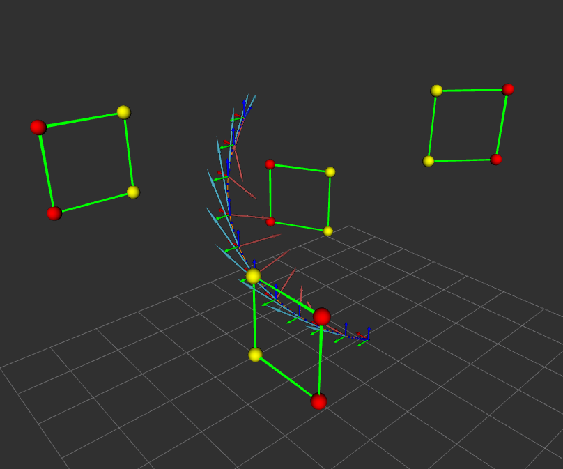
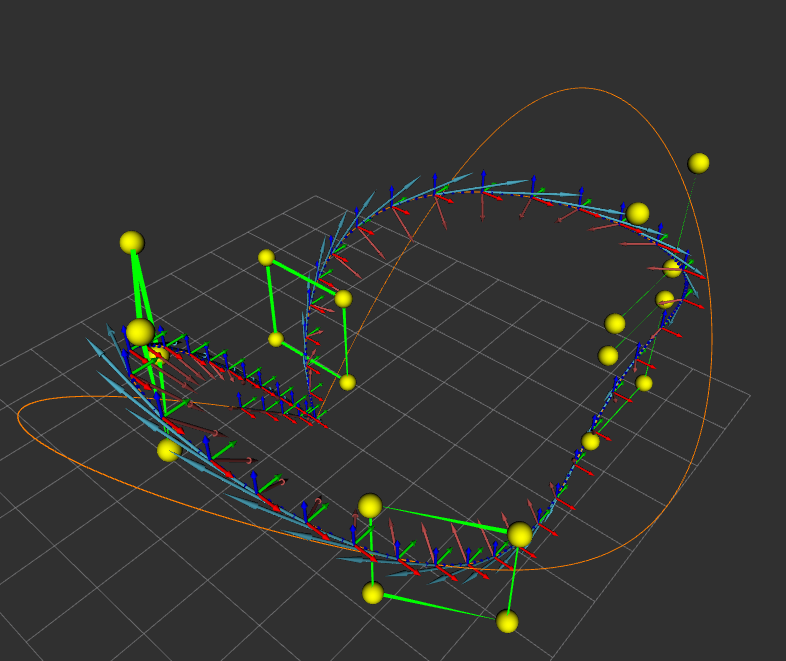

# Laboratory 3
Before starting **important**:
```bash
source devel/setup.bash
```
It is good practice to run at startup even if it is not used directly:
```bash
roscore
```

## Start
Check that everything is working
```bash
catkin_make
roslaunch hector_quadrotor_gazebo quadrotor_empty_world.launch
```
This command opens gazebo11 where you can view the drone.

## Exercise 1

**Include the package in your workspace and compile it using catkin build. To execute it, run roscore in one tab of the terminal. Run an instance of rviz in a second tab**

```bash
rosrun rviz rviz
```
Open the visualization configuration `File -> Open Config -> arob6.rviz`
```bash
rosrun lab3_drones drone_race _targets_file_path:=/home/arob/catkin_ws/src/p14_arob_lab3_drones/data/gates.txt

```
As a result we see the following image:


_Gates_

## Exercise 2

**Open the file drone_race.cpp and localize the function drawGateMarkers. Observe how to specify in the code the properties of the markers and understand how the gate is created. Change the left corners of the gate to make them yellow spheres with a radius of 25 centimeters**


```c++
//Sphere
marker.type = visualization_msgs::Marker::SPHERE;

// Make yellow corners
marker.color.r = 1.0;
marker.color.g = 1.0;

//Radius
marker.scale.x = 0.25;
marker.scale.y = 0.25;
marker.scale.z = 0.25;

```

As a result we see the following image:



_Gates 2_


## Exercise 3

**Toggle on the topics trajectory_vectors and trajectory_markers in rviz. Run again the drone_race node and observe the trajectory computed in the example. Observe how the trajectory changes if you comment the velocity constraint of the middle vertex. Observe also how the acceleration changes if you reduce the segment times.**

**Now you are ready to dive into the function generate_trajectory, which contains part of the necessary code to compute a trajectory given the list of gates**

```c++
void DroneRace::generateTrajectory_() {
    // Set the dimension and derivative to optimize
    const int dimension = 3; // x, y, z
    const int derivative_to_optimize = mav_trajectory_generation::derivative_order::SNAP; // Minimize snap for smooth flight

    // Initialize vertices to store waypoints
    mav_trajectory_generation::Vertex::Vector vertices;

    // Add starting point (current drone position) as the first vertex
    mav_trajectory_generation::Vertex start(dimension);
    start.makeStartOrEnd(Eigen::Vector3d(0.0, 0.0, 0.0), 
                         derivative_to_optimize);
    vertices.push_back(start);

    // Add the gate positions as intermediate vertices
    for (size_t i = 0; i < gates_.size(); ++i) {
        geometry_msgs::Pose gate_pose = gates_[i];
        mav_trajectory_generation::Vertex middle(dimension);
        middle.addConstraint(mav_trajectory_generation::derivative_order::POSITION, 
                             Eigen::Vector3d(gate_pose.position.x, gate_pose.position.y, gate_pose.position.z));
        vertices.push_back(middle);
    } 

    // Manually set

    // Add final position (last gate) as the end vertex
    mav_trajectory_generation::Vertex end(dimension);
    end.makeStartOrEnd(Eigen::Vector3d(0.0, 0.0, 0.0), 
                         derivative_to_optimize);
    vertices.push_back(end);


    // Provide time constraints for each segment
    std::vector<double> segment_times;
    const double v_max = 2.0;  // Max velocity in m/s
    const double a_max = 2.0;  // Max acceleration in m/s^2
    segment_times = mav_trajectory_generation::estimateSegmentTimes(vertices, v_max, a_max);
    
    for (size_t i = 0; i < segment_times.size(); ++i) {
        if (segment_times[i] <= 0.0) {
            ROS_WARN("Segment time at index %lu is zero or negative, adjusting to a small positive value. Time: %f", i, segment_times[i]);
            segment_times[i] = 0.9;  // Adjust to a small positive value if needed
        } else {
            ROS_INFO("Segment time at index %lu: %f", i, segment_times[i]);
        }
    }

    // Solve the trajectory optimization problem
    const int N = 10;  // Degree of the polynomial (must be even, and at least 2x the highest derivative to optimize)
    mav_trajectory_generation::PolynomialOptimization<N> opt(dimension);
    opt.setupFromVertices(vertices, segment_times, derivative_to_optimize);
    opt.solveLinear();

    // Obtain the trajectory
    trajectory_.clear();
    opt.getTrajectory(&trajectory_);

    // Sample the trajectory (to obtain positions, velocities, etc.)
    mav_msgs::EigenTrajectoryPoint::Vector states;
    double sampling_interval = 0.01;  // Time between trajectory points
    bool success = mav_trajectory_generation::sampleWholeTrajectory(trajectory_, sampling_interval, &states);
    
    if (!success) {
        ROS_ERROR("Failed to sample trajectory");
        return;
    }

    // Example of accessing trajectory data (optional)
    ROS_INFO("Trajectory total time: %f seconds", trajectory_.getMaxTime());
    ROS_INFO("Total number of states: %lu", states.size());
    ROS_INFO("Position at third state: X = %f, Y = %f, Z = %f", 
              states[2].position_W[0], states[2].position_W[1], states[2].position_W[2]);

    // Visualization markers
    visualization_msgs::MarkerArray markers;
    double distance_between_markers = 0.5;  // Distance between trajectory markers
    std::string frame_id = "world";
    mav_trajectory_generation::drawMavTrajectory(trajectory_, distance_between_markers, frame_id, &markers);
    pub_traj_vectors_.publish(markers);

    // Visualize trajectory using custom markers
    drawTrajectoryMarkers_();

    // Generate the list of commands to publish to the drone (optional)
    // Here you can prepare the commands based on the sampled trajectory points
    // for controlling the drone in real time using either /cmd_vel or /command/pose topics.
    // INCLUDE YOUR CODE HERE FOR DRONE CONTROL
    for (size_t i = 0; i < states.size(); ++i) {
        geometry_msgs::PoseStamped pose_msg;

        // Fill in the position
        pose_msg.header.stamp = ros::Time::now();
        pose_msg.header.frame_id = "world";
        pose_msg.pose.position.x = states[i].position_W[0];
        pose_msg.pose.position.y = states[i].position_W[1];
        pose_msg.pose.position.z = states[i].position_W[2];

        // Fill in the orientation (quaternion)
        pose_msg.pose.orientation.x = states[i].orientation_W_B.x();
        pose_msg.pose.orientation.y = states[i].orientation_W_B.y();
        pose_msg.pose.orientation.z = states[i].orientation_W_B.z();
        pose_msg.pose.orientation.w = states[i].orientation_W_B.w();

        // Publish the pose command
        pub_goal_.publish(pose_msg);

        // Sleep for the sampling interval to simulate real-time control
        ros::Duration(sampling_interval).sleep();
    }
}

```

Para poder visualiza





## Exercise 4
**Complete all the necessary code to make Hector follow a trajectory that goes through all the gates. Hector must start and end the race at the origin of coordinates. Your solution has to work with the two race tracks that we provide (gates.txt and gates_hard.txt).**
```c++
```


