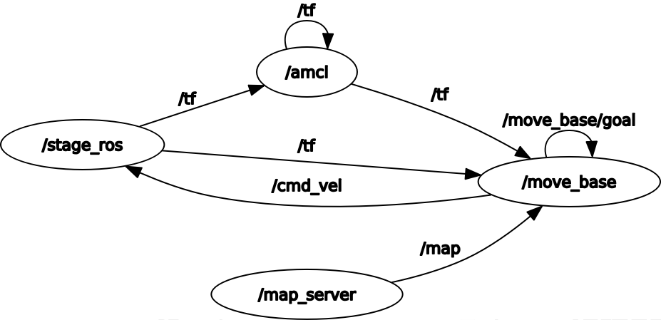

# Path Planning for Autonomous Robots Using A*

This project implements a **path planning algorithm based on A*** for autonomous navigation in robot simulations. The system is integrated with the **ROS Navigation Stack** and tested in simulated environments using **Gazebo**. 

## Project Overview
The goal of this project is to evaluate the performance of an enhanced A*-based path planner in environments with obstacles. The planner is implemented as a high-level plugin in the ROS Navigation Stack, allowing seamless integration with standard tools. 

Key features:
- Path planning with A* algorithm.
- Real-time navigation in simulated environments using Gazebo.
- Evaluation of performance metrics such as path length, computation time, and success rate.

---

## System Architecture
The project follows a modular design based on ROS:
- **Nodes and Topics**:
  - **Planner Node**: Computes the optimal path using A*.
  - **Controller Node**: Executes the planned path.
  - **Map Server**: Provides the occupancy grid for path planning.
  - **RViz Integration**: Visualizes the robot's navigation process.

A detailed diagram of the node and topic connections can be found in `images/rosgraph.png`.

---

## Prerequisites
Before running this project, ensure that the following are installed:

### System Requirements
- **Operating System**: Ubuntu 20.04 with ROS Noetic.
- **ROS Packages**:
  - `ros-noetic-navigation`
  - `ros-noetic-tf`
  - `ros-noetic-gazebo-ros`
- **Python Libraries**:
  ```bash
  pip install matplotlib numpy


# Installation
1. Clone this repository
```bash
git clone https://github.com/JuanLorenteGuarnieri/catkin_ws.git
cd final
```
2. Build the project in a catkin workspace:
```bash
mkdir -p ~/catkin_ws/src
cd ~/catkin_ws/src
ln -s /path/to/this/repository .
cd ~/catkin_ws
catkin_make
source devel/setup.bash
```

# Usage
Before starting **important**:
```bash
source devel/setup.bash
```
It is good practice to run at startup even if it is not used directly:
```bash
roscore
```

## Start
Terminal 1:
```bash
roscore
```

Terminal 2:
```bash
roslaunch final final.launch
```